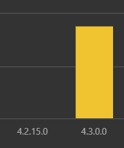

# Adding self-update capabilities to UWP apps

The Microsoft Store is a valuable distribution tool for Windows app developers, and one of its marquee features is to automatically update apps on everyone's machines. This comes with a couple caveats, however:

1. Updates are checked once every 24 hours
1. Even though updates are found, they aren't downloaded and applied unless Windows itself deems there are enough free resources that can be spared. (I don't know the logic behind this, though)

The result is that while Microsoft guarantees eventual consistency, the rate of adoption is at the mercy of Windows (because the OS has always been responsible for downloading and updating MSIX apps, not the Microsoft Store itself).

To help nudge users along, the Microsoft Store SDK provides APIs to manually check for updates and apply them immediately. And in this library, I packaged up the raw APIs into relatively easy-to-use classes that can be plugged into any app quickly and seamlessly. 

### Code sample

```csharp
// Make sure to install this first: https://www.nuget.org/packages/JeniusApps.Common.Uwp

using JeniusApps.Common.Tools;
using JeniusApps.Common.Tools.Uwp;

private readonly IAppStoreUpdater _appStoreUpdater;

// If you use dependency injection, you can do this:
public MyClass(IAppStoreUpdater updater)
{
    _appStoreUpdater = updater;
}

// If you don't use dependency injection, you can do this:
// public MyClass()
// {
//     _appStoreUpdater = new MicrosoftStoreUpdater();
// }


private async Task CheckForUpdatesAsync()
{
    // This method will check for updates
    // and attempts to download it silently in the background.
    // If the download is successful, then the recommended UX
    // is to display a subtle alert to the user to apply the update.

    var hasUpdates = await _appStoreUpdater.CheckForUpdatesAsync();
    if (!hasUpdates)
    {
        return;
    }

    var downloadSuccessful = await _appStoreUpdater.TrySilentDownloadAsync();
    if (downloadSuccessful)
    {
        // TODO: Show a button or something in UI inviting
        // the user to apply the update.
    }
}

private async Task ApplyUpdatesAsync()
{
    // This will restart the app and apply the update.
    await _appStoreUpdater.TrySilentDownloadAndInstallAsync();
}
```

### Recommended UX

With this library, you can trigger the background update anytime you want. However, my recommendation is to follow the UX of [Ambie](https://github.com/jenius-apps/ambie)/Chrome/VS Code/Microsoft Edge which is as follows:

1. Let the user launch the app without any interruption.
1. In a background thread, trigger the `CheckForUpdatesAsync()` method.
1. If an update is available, show a button on the UI to apply the update. **But do not interrupt the user's flow**. Display the button somewhere on the side or in the corner.
1. Trigger the `ApplyUpdatesAsync()` method if the user clicks the button. This restarts the app and applies the update instantly, just like Ambie/Chrome/etc.
1. Even if the user never clicks your "Apply update" button, the OS will apply the update any time your user shuts down your app because the SDK has already downloaded and queued the update. The "Apply update" button just helps nudge them along faster.

### Results in Ambie

After using this self-updating functionality, Ambie was able to migrate thousands of users to the latest package within 3 days as opposed to a couple weeks.



### Caveat

This library currently uses APIs that respect the Microsoft Store's "auto-update" setting. In other words, if the user turns off "auto-update", then this library does not work.

I will be updating this library in the future to handle those scenarios where the user disabled auto-updates.
